## UIUCTF 2020

Published 26 July 2020 by Shawn Duong (IrisSec skat).

Our computer hacking club, IrisSec, just finished UIUCTF 2020 last weekend. This was our first competition under the name "IrisSec" and also our first competition with our new club roster, so this was very exciting working alongside some new members together! Throughout the course of this competition, I primarily focused on the OSINT challenges since that's one of my specialties (right next to digital forensics and network security). For this writeup, I'm going to be covering the following challenges:

Contents:

- OSINT
  - Starter OSINT
  - Isabelle's Bad Opsec 1
  - Isabelle's Bad Opsec 2
  - Isabelle's Bad Opsec 3
  - Isabelle's Bad Opsec 4
  - Isabelle's Bad Opsec 5
- Crypto
  - coelacanth\_vault

Before starting these writeups, I would like to acknowledge everyone else in our team who participated in UIUCTF 2020 with me:
- [[nope]]
- ! Carp\_704
- Brru
- cold\_synster
- KosmicVael
- nate
- sadboiben 
- Yoko Zoko

I would also like to acknowledge SIGPwny for creating a very enjoyable competition. With that said, let's go ahead and start these writeups with the OSINT series created by SIGPwny's Thomas in which we follow the fictional hacker Isabelle throughout the internet.

## OSINT

For starters, **OSINT** is short for **Open-Source Intelligence**. Open-source intelligence is intelligence collected from publicly available sources such as social media websites, public leaks and pastes, public IRC channels, etc. The "open-source" in "open-source intelligence" refers to the fact that it is clear and public. OSINT is valuable to any digital investigation, and as such, this set of writeups will also be stressing how all of these techniques and tactics can be applied to real-world scenarios and settings.

### Starter OSINT

> Our friend isabelle has recently gotten into cybersecurity, she made a point of it by rampantly tweeting about it. Maybe you can find some useful information ;).
> 
> While you may not need it, IsabelleBot has information that applies to this challenge.
> 
> Finishing the warmup OSINT chal will really help with all the other osint chals
> 
> The first two characters of the internal of this flag are 'g0', it may not be plaintext
> 
> Made By: Thomas (I like OSINT)

All OSINT operations have some sort of information as a starting point, a "given" if you will. What we know right now is that someone **named** "Isabelle" has gotten into **cybersecurity** and has been **tweeting** about it. This statement alone allows us to start with three pieces of valuable information:

1. They're named Isabelle.
2. They're into cybersecurity.
3. They're on Twitter.

There's also the additional clue from IsabelleBot located in the Discord server of the event, who seems to know something that can help us. After running the `!help` command on IsabelleBot, we get a list of commands she supports:

> Here's a list of all my commands:,eventtime, flag, help, ping, timeleft,
> You can send !help [command name] to get info on a specific command!
> 
> Oh yeah, there is also the hoodie command and the bet command. Ah yes. You can try networking with me with !socials.
> I also totally forgot the currency stuff. That's work,bet,transfer,balance,inventory,shop, and buy.

That `!socials` command looks really interesting, especially since we know that Isabelle is located on Twitter. When we run that command, she sends us another clue:

> I'm a hacker, but I'm also Isabelle. Maybe you could call me... IsabelleHacker? No, that sounds strange... Whatever, it will be something like that.

Now we know that her username is *like* "IsabelleHacker," and so we can deduce some possible usernames that she might use:

- IsabelleHacking
- IsabelleHack
- IsabelleSecurity
- HackingIsabelle
- HackerIsabelle
- SecurityIsabelle

After querying Twitter for users with usernames similar to this, we stumble upon a positive result from "HackerIsabelle."

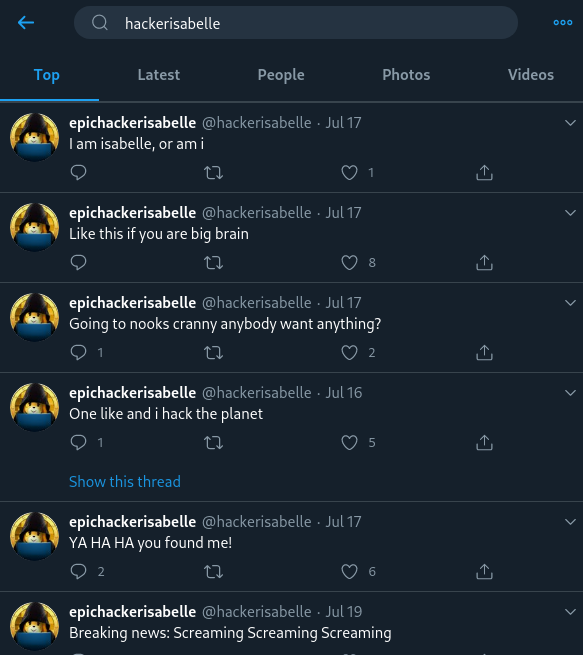

Looks like we've found her! Let's do some digging into her account to see if anything interesting or valuable to us pops up. Something interesting about Twitter is that replies are automatically hidden from the primary profile page, and you actually have to go into "Tweets \& replies" in order to see replies *in addition* to regular tweets.

After some scrolling, we stumble upon the flag in a tweet.

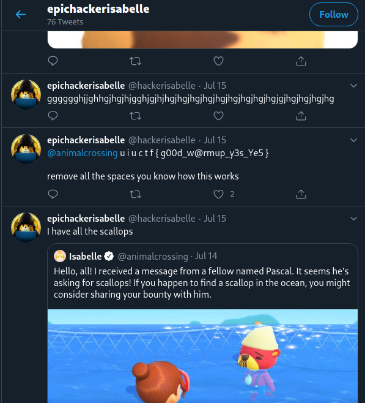

Now that we've found the flag, let's shift focus from the competition's environment to the real-world environment. **How can this be applied in real life?**

In real life OSINT engagements, you'll often times have only a minimum amount of information to go off of. It's important that you can understand to the fullest extent possible the value of the information that you do have. I recall from the National Cyber League last season an OSINT challenge in which we were given a few vague pictures pointing to a location and the only things we could go off of were a few vague highway signs, but we were able to deduce the exact location based on the (cropped) texts of the signs, the rural-like backgrounds of the pictures, and hell, even the shape and color of the signs!

When you're given a starting point in an OSINT engagement, study it, understand it, and think of every single possible implication of the given information to the fullest extent possible in order to get your foot into the door of the investigation.

### Isabelle's Bad Opsec 1

> Isabelle has some really bad opsec! She left some code up on a repo that definitely shouldnt be public. Find the naughty code and claim your prize.
> 
> Finishing the warmup OSINT chal will really help with this chal
> 
> The first two characters of the internal of this flag are 'c0', it may not be plaintext Additionally, the flag format may not be standard capitalization. Please be aware
> 
> Made By: Thomas

We are now told that Isabelle has left some code up on a repository that is publicly accessible. Because we were able to get our foot in the door by finding her Twitter in the previous challenge, we can deduce from another tweet that she has a GitHub account. For the uninitiated, GitHub is one such website hosting git repositories for code. The information from this tweet is consistent with the information from the challenge description suggesting she has a code repository somewhere:


The next step is to find out where her GitHub is. A quick search of "HackerIsabelle" returns no positive results. We can again use her tweets to deduce some facts about her.

Clue #1: her Twitter bio referencing "0x15ABE11E."

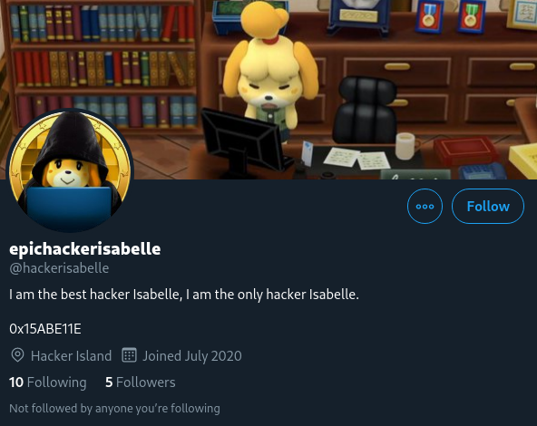

Clue #2: a tweet referencing "0x15ABE11E."


Clue #3: a tweet again referencing "0x15ABE11E."


From clues #1-3, we can deduce that "0x15ABE11E" may be a possible alias and possibly a username that she might use, or if not then at least another string she might mention elsewhere.

Clue #4: a reference to "mimidogz" and an error.


There are a few more references to mimidogz, but this is perhaps the most significant one as the error referenced suggests that mimidogz is a program. We can deduce that this may be the name of a project that Isabelle is working on.

Clue #5: a tweet referencing "IsabelleOnSecurity."


From this clue, we can deduce that "IsabelleOnSecurity" is a possible username.

From these three sets of clues, we can query GitHub for any one of "0x15ABE11E," "mimidogz," or "IsabelleOnSecurity" to reach her GitHub profile.

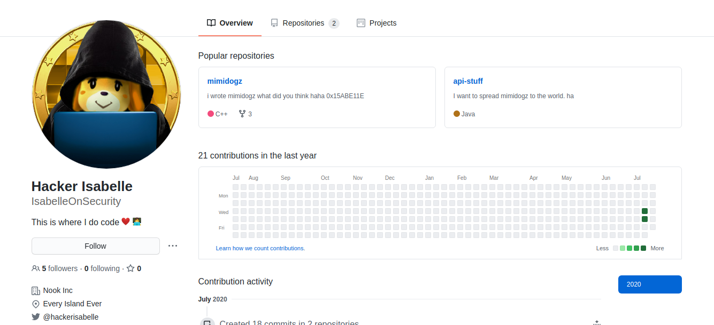

Looking into "mimidogz," we arrive at a code repository.

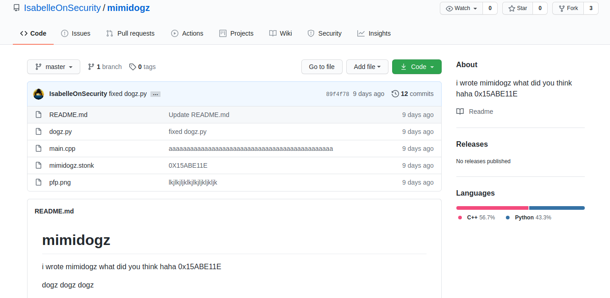

Looking into the `dogz.py` program, we find an interesting chunk of code from lines 40-41.

```python
# Driver Code 
  DRIVER_CODE = "c3BhZ2hldHRp=="
```

This base64 string just decodes to "spaghetti," but could it have been something else in a previous version of this project? When we check the blame for this file, we can see that the driver code was not always that string.

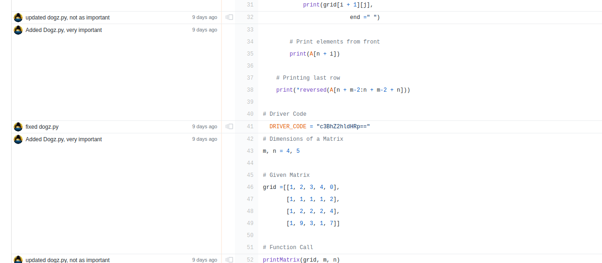

Checking out that specific commit allows us to see the changes made.

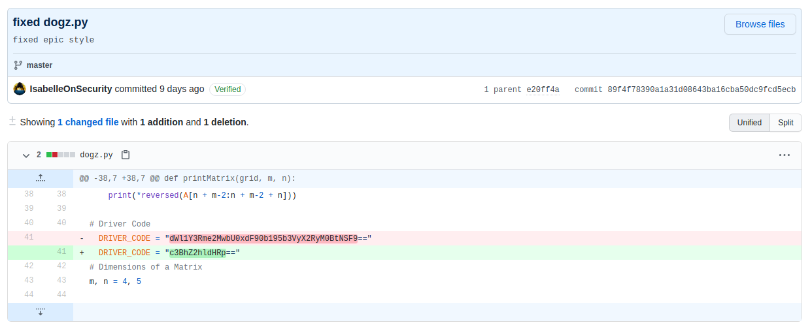

A quick base64 decoding of the string from the older version gives us the flag.

```
[skat@osiris:~] $ echo "dWl1Y3Rme2MwbU0xdF90b195b3VyX2RyM0BtNSF9==" | base64 -d 2>/dev/null
uiuctf{c0mM1t_to_your_dr3@m5!}
```

**Let's talk about how these techniques and tactics can be applied to real life OSINT engagements now.** It's very common in a real life engagement to have to pivot from one platform to another. In this case, it was from Twitter to GitHub. Users might not have the same username from platform to platform, but there are plenty of ways to find them. On many platforms, you can perform a search by email address or phone number. Here, we were able to use deductive reasoning in order to accomplish this.

Something that I've noticed about people is that *we talk a lot*. You don't need to phish out someone's answers to their security questions because they'll oftentimes just give it to you! Whether it's birthdays, their favorite bands, their favorite cars or their elementary schools or the names of their first pets, it usually only takes a few minutes of scrolling through their online activity to find this information *because they don't keep it a secret to begin with*. Because Isabelle was publicly talking about her project, we were able to pivot from Twitter to GitHub by knowing the name of the project as well as some other tidbits of information about her such as potential usernames.

In a real life OSINT engagement, *it is important to understand the value of a person's ego*. By paying attention to someone's likes, dislikes, projects, friends, background, etc. you can learn a lot about a target. Is your engagement against a drug ring? Check out their social media friends and follows. Check out their Instagram highlights where they openly flaunt around gang and drug paraphernalia. A person's ego can fuel their pride but it can also fuel your operation.

> "To the people in the audience, the h4x0rz, lose the ego ... Cred is your enemy, don't talk about the s\*\*\* that you're doing."
> \- Zoz, DEFCON 22 "Don't F\*\*\* It Up!"

### Isabelle's Bad Opsec 2

> Wow holy heck Isabelle's OPSEC is really bad. She was trying to make a custom youtube api but it didnt work. Can you find her channel??
> 
> Finishing Isabelle's Opsec 1 will may you with this challenge
> 
> The first two characters of the internal of this flag are 'l3', it may not be plaintext Additionally, the flag format may not be standard capitalization. Please be aware
> 
> Made By: Thomas

Looks like we need to find Isabelle's YouTube channel now. The challenge description mentions that she was trying to make a custom YouTube API, which was something that we actually saw in the last challenge as another repository on Isabelle's GitHub account. Let's go ahead and see what that repository has to offer.

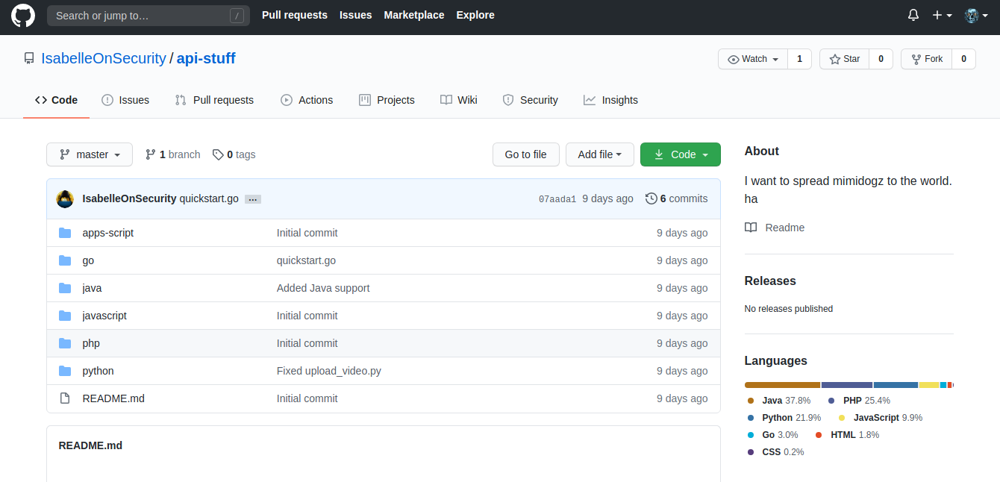

Having a look through the commit log and seeing the most recent commit brings us to this:

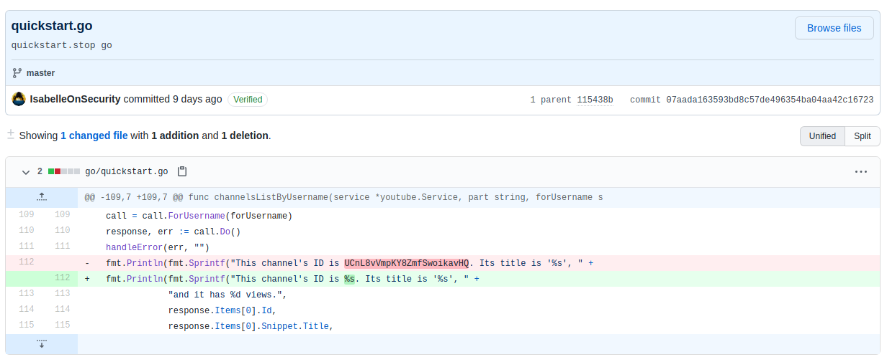

It looks like we've found a channel ID that was deleted in a commit. On YouTube, channel URLs are in the format `www.youtube.com/channel/<ID>`, so let's so ahead and see if that channel exists. Upon visiting the expected channel URL, we can see that the channel does indeed exist.


After exploring her channel for a little bit, we see some outgoing links to her Twitter and website.


Clicking on the link to her website brings us to the following: `https://uiuc.tf/?flag=uiuctf%7Bl3g3nd_oF_zeld@_m0re_like_l3gend_0f_l1nk!%7D`

Looks like the flag is in the URL! All we have to do before submitting is change `%7B` and `%7D`, which are just [percent encoded](https://en.wikipedia.org/wiki/Percent-encoding), into their ASCII `{` and `}` counterparts, respectively.

**So what have we learned?** Perhaps the most important lesson is understanding the importance of understanding data leakage. It might surprise you, but it's actually incredibly common for people to accidentally leave out API keys, SSH keys, or other sensitive information and then try to fix it with just a new commit. *One of the many intended features of git is the ability to explore a repository at a previous point in time.* Data leakage is very real, and understanding how you can detect and interpret data leakage can be a valuable skill during OSINT operations to better assess a target.

### Isabelle's Bad Opsec 3

> Isabelle has a youtube video somewhere, something is hidden in it.
> 
> Solving Previous OSINT Chals will help you with this challenge
> 
> The first two characters of the internal of this flag are 'w3', it may not be plaintext. Additionally, the flag format may not be standard capitalization. Please be aware
> 
> Made By: Thomas

Now that we've found Isabelle's YouTube channel, it looks like we need to find a video and some information hidden in the video. As we saw in the previous level, Isabelle has [one video uploaded](https://www.youtube.com/watch?v=djhRaz3viU8).

Something I noticed about this level is that the captions were absent for the last second of the video. Immediately, this becomes a source of suspicion. For this level, I have to credit my teammate [[nope]] for discovering the hidden data inside of one of the caption files.

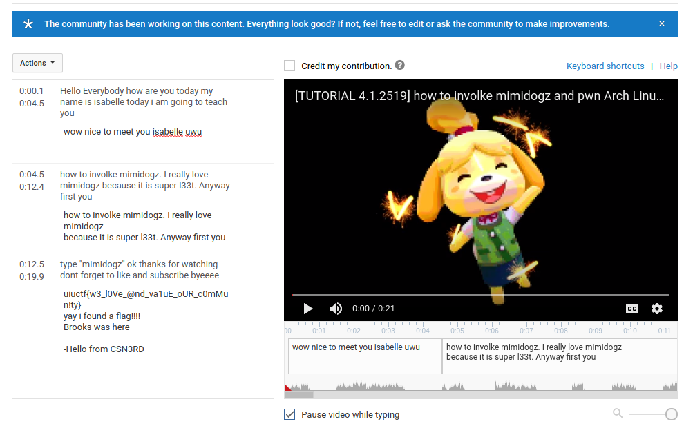

I must admit that without my teammate [[nope]], I would not have gotten this. I was actually trying to perform all sorts of steganography on the video to see if there might have been something hidden in the video or audio streams.

**Applying this to real life OSINT now,** we learn that sometimes evidence may be left behind by the *community* surrounding a target and not necessarily by the target themselves. In this case, it was left behind in a community-driven set of captions for a video as opposed to being left behind by the target Isabelle herself. For example, if you're in an OSINT engagement and investigating a group of covert suspects that are roaming around an area, you might benefit from looking at photos geotagged near the area recently posted to social media to track their movement and path. OSINT, while it may have a target, can gather valuable information from sources other than the target themselves.

### Isabelle's Bad Opsec 4

> Isabelle hid one more secret somewhere on her youtube channel! Can you find it!?
> 
> Finishing previous OSINT Chals will assist you with this challenge
> 
> The first two characters of the internal of this flag are 'th', it may not be plaintext
> 
> Additionally, the flag format may not be standard capitalization. Please be aware
> 
> Made By: Thomas [Authors Note] I love this chal because I used it IRL to find out who someone cyberbullying a friend was. It's real OSINT -Thomas

We're not given much more to go off of here except for the fact that it's somewhere on her YouTube channel. I admit that this is actually one of the more difficult OSINT challenges in this series, and was actually the one that I finished last. This was truly a subtle challenge.

Looking at the YouTube channel, we notice something strange. Can you see it?


The channel banner image is very oddly cropped, to say the least. Something interesting about YouTube (and many sites, actually) is that it serves a different version of a webpage depending on your user agent. If you're on a smartphone, then the dimensions of the smartphone are taken into account and you're served a website tailored to your smaller screen. On a standard laptop monitor like mine, I'm served a version of the website tailored to my screen size. In each of these differently-tailored versions of the same website, images can likewise be cropped.

Would it be possible to retrieve the full image somehow? Simply inspecting the element using the Chrome and opening up the URL to the image just brings us to the post-cropped version.


Upon looking at the source code of the page and looking for banners, we notice that YouTube does indeed serve different banners based on whether you're on mobile, a desktop, or a television. We can see the URL to the banner that they serve to televisions after a closer look.

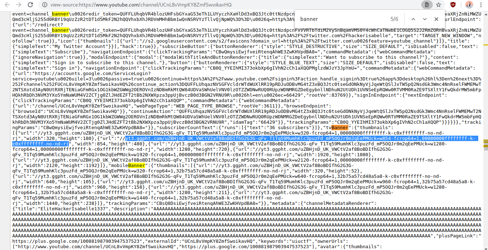

Going there brings us to the flag!


I again must admit that this was difficult and a real step away from the obvious due to how incredibly subtle it is. What I was actually initially trying to do was use the account's Google Plus ID, a hidden artifact of a long-dead legacy in YouTube, to track Isabelle's activity across the internet, such as seeing her Google Maps reviews for instance.

You can see her Google ID here, hidden away in the source code and forgotten to be scrubbed by YouTube developers for years, still leaving a legacy in the source code:

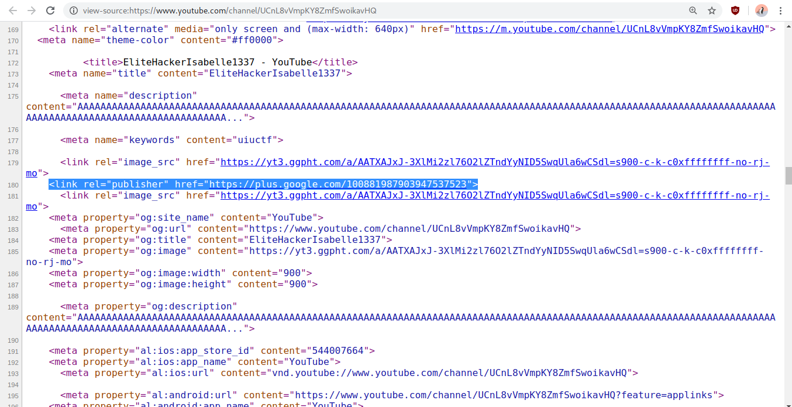

Using the Google Plus ID, `100881987903947537523`, we can track the account's activity across different Google platforms such as Maps reviews. Isabelle's can be found at [google.com/maps/contrib/100881987903947537523/reviews/](https://www.google.com/maps/contrib/100881987903947537523/reviews/). 


Once again, this wasn't the solution. This was just something that I tried and discovered about Google platforms, and possibly something that I'll be incorporating into real-life OSINT engagements in the future. Imagine going to someone's YouTube channel, getting their Google Plus ID, and then getting their approximate location based on their Google Maps reviews! This might make for an interesting future challenge if any potential CTF organizers are reading this (*hint hint, nudge nudge*).

**Applying the solution to real-life OSINT now,** we learn that you should explore features provided to different platforms in order to gain a fuller picture of your target. Here, different images were served to mobile, desktop, and television users. In a real-life engagement, some information might only be accessible to mobile users, or only to desktop users, or only to television users, or any other variant of this that you can think of. Snapchat, for example, is a mobile-focused platform and you won't get very far with it from your laptop. This is not to say that you need to own different devices! User-agent spoofing is very much real, as are emulators and virtual machines. Like we saw here, we were able to access information served to television devices by carefully studying the YouTube platform through inspecting the website source code.

### Isabelle's Bad Opsec 5

> Isabelle had one more secret on her youtube account, but it was embarrassing.
> 
> Finishing previous OSINT Chals will assist you with this challenge
> 
> The first two characters of the internal of this flag are 'hi', it may not be plaintext
> 
> The flag capitalization may be different, please be aware

The words that pop out to me here are "had" and "was." These words imply that this secret used to be there, but isn't anymore. Is there a way to access previous versions of a web page?

Yes, yes there is! The [Wayback Machine](https://archive.org/) is a project by Archive.org that saves snapshots of web pages at different points in time. Let's see if a historical snapshot of her YouTube channel is available.

As of writing this, the snapshot has unfortunately been removed so I cannot provide a screenshot. However, the solution was to view the historical snapshot of the site and the flag is hidden in the URL of the "My website" link seen in Opsec 2. The flag this time was `UIUCTF{hidd3n_buT_neVeR_g0n3}`.

**In real-life OSINT engagements,** we learn that it's possible to recover historical data on the internet. If a website tried to "scrub" some data, it's possible that a snapshot of it pre-scrub might be saved somewhere on the internet. Viewing this historical snapshot can uncover things like addresses, links, incriminating texts and documents, etc.

### OSINT Conclusion

Well, that's the end of the OSINT series! I had a lot of fun doing this series and it was one of the more enjoyable OSINT experiences I've had. It's a real shame that OSINT oftentimes gets overlooked and not many CTF organizers include it, so it was very refreshing to see this event feature them!

While I'd be tempted to conclude this set of writeups here, I'm going to indulge for just a minute and talk about a crypto challenge I did: coelacanth\_vault.

## Crypto

Crypto is short for **cryptography** and is the study of ciphers and encryption. It is essential to securing our digital communications today and is very heavy on mathematics.

### coelacanth\_vault

> Why would you waste your time catching more than one coelacanth?
> 
> nc chal.uiuc.tf 2004
> 
> Author: potatoboy69

Having solved this challenge was really significant to me as someone who's never considered mathematics to be a personal strength. I have a massive appreciation for mathematics, yes, but it's not particularly a *passion* of mine as it is a passion for others. Solving this cryptography challenge helped alleviate some of the impostor syndrome I experience as someone who is usually the youngest and least experienced guy in any math class or environment at my university.

I've included the challenge's attached source code in case you'd like to attempt it for yourself. You can find it here: [coelacanth\_vault.py](./files/2020-uiuctf/coelacanth_vault.py) (SHA1: 335c2bf1c838f90d07f8de8e61a420ebb51de4a1)

A few days after the end of the competition, I emailed my friend Kevin Dao, a mathematics undergraduate at the University of California, San Diego, about this challenge and how I solved it. A (revised) excerpt of my email to him is included below:

> A random, relatively large, non-prime number is generated. For example: 24141917630136328546962. This is the secret and the user does not know what this number is. Let's call it s for secret. The point of the challenge is to find out what s is.
>
> To help find s, the user is given 9 pairs of numbers (r, p),  where r is the result of s mod p, and p is a randomly generated 8-bit prime number. For example, these 9 given pairs may be: (122, 233), (144, 241), (9, 199), (10, 137), (21, 223), (84, 163), (182, 239), (89, 179), (68, 227). In other words, s mod 233 = 122, s mod 241 = 144, s mod 199 = 9, ...
>
> After doing a lot of digging, I found out that the Chinese remainder theorem would help me solve this problem. In the example pairs above, the family of solutions to x ≡ 122 (mod 233), x ≡ 141 (mod 241), x ≡ 9 (mod 199), ... would be expressed by 364288974528818568854 + 540400651263807044957\*n. The number s mentioned earlier is indeed a member of this family of solutions. The challenge gave us 250 tries to get it right, so for this challenge I tested out values of n from 1 to 250 until I eventually got the number right.
>
> I've attached the challenge if you'd like to give it a try. It's a Python program. The initial question when it asks, "How many coelacanth have you caught?" is just asking you for how many pairs you'd like. I'd recommend 9 as this is the maximum the program allows and if I'm not mistaken, the more pairs we have, the more accurately we can to deduce s.

An excerpt of his response is included below:

> I'm glad you are asking about the Chinese Remainder Theorem because it is just a special case of a result in Ring Theory. More specifically, it is a special case of a result in Commutative Ring Theory / Commutative Algebra which is precisely the field I am interested in as well (alongside my main interest in Algebraic Geometry). 
> 
> Okay, so there are two ways to understand the Chinese Remainder Theorem. The number theoretic case with modular congruences is the number theoretic case which uses Bezout's Theorem. In commutative ring theory, we replace the integers with a more general object called a "commutative ring" which has a lot of the key properties of the integers.
> 
> I wrote up a quick piece of exposition which I've attached in this email. There are also a number of expositions on the topic. I think Rosen's text has a section on the theorem. Keith Conrad's expository paper (attached) is also very good, but a bit heavy on notation. I hope they are helpful. The only issue I have with them is that they focus on the number theoretic aspect (which I do appreciate). The result can be generalized and so my piece of exposition is going to give you a bit of a crash course on basic commutative ring theory.

Fascinating! I admit that I was surprised by the depth associated with the Chinese remainder theorem as I thought it was just a clever "math hack" similar to how Japanese multiplication is a clever "math hack."

If you'd like to read Dao's exposition or Conrad's paper, you can see them here: [Dao](./files/2020-uiuctf/CRT-KevinDao.pdf), [Conrad](./files/2020-uiuctf/CRT-KeithConrad.pdf). Credits to Kevin Dao, undergraduate at the University of California, San Diego, and Keith Conrad, a professor at the University of Connecticut, respectively. Keep in mind that Kevin wrote this in a single morning after having received my email. Mathematicians amaze me.

Feel free to give either or both papers a read. For the purposes of this writeup, I'm going to be giving an ELI5 explanation and massively oversimplifying.

The Chinese remainder theorem basically allows us to solve for an unknown number, let's call it x, when given a multiple congruences x ≡ a (mod b). In other words, if we don't know what a number is but we know the remainders of that number divided by different primes (well, they really only have to be coprime to each other), then we can mathematically compute the family of solutions that the unknown number is a member of.

Let's do an example with a smaller number like x = 26734. Suppose we don't know what this number is, but we know that x mod 13 = 6, x mod 29 = 25, and x mod 7 = 1. This can be rewritten as the system of congruences x ≡ 6 (mod 13), x ≡ 25 (mod 29), and x ≡ 1 (mod 7).

We'll start with the congruence with the largest modulus and slowly work to the congruence with the smallest modulus. Starting at x ≡ 25 (mod 29), we can rewrite this as x = 29j + 25 where j is an integer. Hopefully this makes sense so far, because if the remainder of x divided by 29 is 25, then it must logically be true that x is a multiple of 29 (hence 29j) plus that remainder 25.

Substituting x into the congruence with the next largest modulus, if x = 29j + 25 and x ≡ 6 (mod 13), then it must therefore be true that 29j + 25 ≡ 6 (mod 13). This can be simplified to j ≡ 11 (mod 13), which can be rewritten like we did earlier as j = 13k + 11.

We now take j = 13k + 11 and substitute it into x = 29j + 25, so x = 29(13k + 11) + 25, which simplifies to x = 377k + 344.

We rinse and repeat once more for the last congruence, x ≡ 1 (mod 7). If x = 377k + 344 and x ≡ 1 (mod 7), then it must be true that 377k + 344 ≡ 1 (mod 7), which can be simplified to k ≡ 0 (mod 7), which can be rewritten as k = 7l + 0.

We will once again substitute this result into our original equation for x. If x = 377k + 344 and k = 7l, then x = 377(7l) + 344, which can be simplified to x = 2639l + 344. We are now complete and this expression represents the family of solutions to our system of congruences. When we let l be 0, x = 344, and 344 mod 13 = 6, 344 mod 29 = 25, and 344 mod = 1 are all true. Everything checks out!

Our desired answer, x = 26734, appears when l = 10. The math once again checks out!

I understand that reading math might be a bit difficult, so I went ahead and recorded this video to help you see the Chinese remainder theorem in action: [YouTube](https://www.youtube.com/watch?v=lw-oBDiBleI)

Going back to the challenge now, we simply just apply this same procedure to larger numbers. It's very easy to just use an online calculator like [this one](https://comnuan.com/cmnn02/cmnn0200a/cmnn0200a.php), but I highly recommend anyone reading this to try to understand the math because it truly is very neat!

For the record, the flag was `uiuctf{small_oysters_expire_quick}`. This was a very fun challenge and I learned something new!

## Conclusion

That's all the writeups I have to offer for UIUCTF 2020. This was a very fun competition and I'm very happy to have been a part of it. I'm looking forward to participating again in future years if SIGPwny decides to host this competition again.
